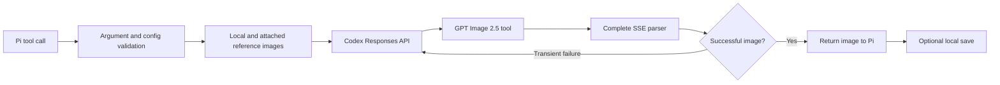

<div align="center">

# Codex Sub Imagen

**Generate and edit images with GPT Image 2.5 directly from [Pi](https://pi.dev).**

[](https://github.com/the-jey/codex-sub-imagen/actions/workflows/ci.yml)
[](LICENSE)
[](https://pi.dev)
[](https://openai.com)

A reliable Pi extension for image generation, image-to-image workflows, and precise edits through your local `openai-codex` authentication.

</div>

---

## Highlights

- **GPT Image 2.5 support** with Sunburst and Flare
- **Image generation and editing** from natural-language instructions
- **Up to four reference images** from local files or Pi message attachments
- **Precise output controls** for quality, dimensions, format, background, and compression
- **Automatic retries** for transient HTTP, network, streaming, and backend failures
- **Complete SSE parsing** that preserves useful backend diagnostics
- **Flexible storage** in global, project, custom, or memory-only mode
- **Backward compatibility** with the legacy `model`, `imagePath`, and configuration filename
- **Zero API-key duplication**: authentication is resolved through Pi's model registry

## Image models

| Model | Best for | Behavior |
| --- | --- | --- |
| `gpt-image-2.5-sunburst` | Precise editing and high-fidelity results | Default |
| `gpt-image-2.5-flare` | Faster generation | Optional |

The image model and the Codex controller are separate:

- `imageModel` selects the GPT Image backend.
- `routerModel` selects the Codex controller that invokes it.

The default controller is `gpt-5.6-luna`. In normal use, leave `routerModel` unset.

## Requirements

- [Pi](https://pi.dev) with package support
- Node.js 20.6 or newer
- A working `openai-codex` login in Pi
- Access to the GPT Image 2.5 models through that account

Authenticate from Pi with `/login` and select `openai-codex` before using the tool.

## Installation

### Global installation

Install once and use the extension from every project on the machine:

```bash
pi install git:github.com/the-jey/codex-sub-imagen
```

### Project-only installation

Run this from the project directory:

```bash
pi install -l git:github.com/the-jey/codex-sub-imagen
```

Pi records project-local packages in `.pi/settings.json`.

### Load without installing

```bash
pi -e git:github.com/the-jey/codex-sub-imagen
```

After installing or updating from another terminal, restart Pi or run:

```text
/reload
```

## Updating

Update this package explicitly:

```bash
pi update git:github.com/the-jey/codex-sub-imagen
```

Or update every installed Pi extension:

```bash
pi update --extensions
```

Install the repository **without a tag or commit reference** if you want updates to follow its default branch.

## Usage

Once loaded, the extension exposes the `codex_generate_image` tool. You can simply ask Pi:

> Generate a cinematic editorial poster with sharp typography, 1536×1024, using Sunburst at xhigh quality.

> Edit `./product.webp`: keep the product unchanged, replace the background with a softly lit marble studio, and save the result in the project.

### High-quality generation

```json
{
  "prompt": "A cinematic editorial poster with extremely sharp typography",
  "imageModel": "gpt-image-2.5-sunburst",
  "quality": "xhigh",
  "size": "1536x1024",
  "outputFormat": "png",
  "save": "project"
}
```

### Fast generation

```json
{
  "prompt": "A friendly robot reading in a warm, colorful library",
  "imageModel": "gpt-image-2.5-flare",
  "quality": "low"
}
```

### Edit a local image

```json
{
  "prompt": "Keep the subject unchanged and replace the background with a minimal photography studio",
  "imagePaths": ["./reference.png"],
  "imageModel": "gpt-image-2.5-sunburst",
  "quality": "xhigh",
  "outputFormat": "webp",
  "outputCompression": 90,
  "save": "project"
}
```

Images attached to the latest user message are included automatically. Set `useAttachedImages` to `false` to disable this behavior.

## Tool parameters

| Parameter | Type | Default | Description |
| --- | --- | --- | --- |
| `prompt` | string | required | Image generation or editing instructions |
| `imageModel` | enum | `gpt-image-2.5-sunburst` | Sunburst or Flare image backend |
| `routerModel` | string | `gpt-5.6-luna` | Codex controller; normally leave unset |
| `quality` | enum | `auto` | `auto`, `low`, `medium`, `high`, `xhigh`, or `max` |
| `size` | string | `auto` | `auto` or custom `WIDTHxHEIGHT` dimensions |
| `background` | enum | `auto` | `auto` or `opaque` |
| `outputFormat` | enum | `png` | `png`, `jpeg`, or `webp` |
| `outputCompression` | integer | — | `0`–`100`, only for JPEG and WebP |
| `imagePaths` | string[] | `[]` | Up to four local reference-image paths |
| `useAttachedImages` | boolean | `true` | Include images from the latest user message |
| `save` | enum | `global` | `none`, `project`, `global`, or `custom` |
| `saveDir` | string | — | Base directory required by `save: "custom"` |

### Custom-size constraints

Custom dimensions must:

- use the `WIDTHxHEIGHT` format;
- be multiples of 16;
- have an aspect ratio between 1:3 and 3:1;
- stay at or below 3840 pixels on each edge;
- contain between 655,360 and 8,294,400 total pixels.

### Reference-image constraints

- Accepted formats: PNG, JPEG, WebP, and GIF
- Maximum count: four images after deduplication
- Maximum size: 20 MiB per image
- Paths may be absolute or relative to the current project
- A leading `@` in a path is accepted and removed

## Output storage

| Save mode | Destination |
| --- | --- |
| `global` | `~/.pi/agent/generated-images/<session>/` |
| `project` | `<project>/.pi/generated-images/<session>/` |
| `custom` | `<saveDir>/<session>/` |
| `none` | Returned to Pi without writing a file |

Generated filenames use the backend image-generation identifier and the selected output extension.

## Persistent configuration

Create a global configuration file:

```text
~/.pi/agent/extensions/codex-sub-imagen.json
```

Or a project-specific configuration file:

```text
<project>/.pi/extensions/codex-sub-imagen.json
```

Project settings override global settings:

```json
{
  "imageModel": "gpt-image-2.5-sunburst",
  "quality": "high",
  "size": "1536x1024",
  "background": "auto",
  "outputFormat": "png",
  "save": "global"
}
```

For backward compatibility, the former `codex-image-gen.json` filename is still recognized. The new `codex-sub-imagen.json` filename takes precedence at the same scope.

The save destination can also be controlled with:

```bash
export PI_CODEX_IMAGE_SAVE_MODE=custom
export PI_CODEX_IMAGE_SAVE_DIR=/absolute/path/to/images
```

Explicit tool arguments take precedence over environment variables and configuration files where applicable.

## Reliability

A single tool call can make up to four attempts: the initial request plus three retries. Retries use exponential backoff and honor the HTTP `Retry-After` header.

Transient conditions such as rate limits, timeouts, upstream connection failures, and server errors are retried. Authentication failures, invalid parameters, usage limits, moderation blocks, and unsupported options fail immediately.

The extension consumes the complete Codex SSE stream before evaluating the image call. This preserves the backend's actual error message instead of replacing it with a generic empty-image failure.

## Compatibility

Older callers remain supported:

- `model: "gpt-image-2.5-sunburst"` is normalized to `imageModel`.
- Other legacy `model` values are treated as `routerModel`.
- `imagePath: "./image.png"` is normalized to `imagePaths: ["./image.png"]`.
- `codex-image-gen.json` remains a supported configuration filename.

A `gpt-image-*` identifier is never sent as the Codex router model.

## How it works



The prompt and selected reference images are sent to the ChatGPT Codex Responses endpoint. Authentication is obtained from Pi's local model registry and is never committed to this repository or written into the package configuration.

## Known limitation

Transparent backgrounds are intentionally not exposed. Although transparency may be documented for related public image APIs, the ChatGPT/Codex endpoint currently rejects it for these GPT Image 2.5 models with:

```text
Transparent background is not supported for this model.
```

Use `background: "auto"` or `background: "opaque"`.

## Development

```bash
git clone https://github.com/the-jey/codex-sub-imagen.git
cd codex-sub-imagen
npm install
npm run check
pi --no-extensions -e .
```

The package ships TypeScript source directly because Pi loads extension modules at runtime. No build artifact is required.

## Security

Please report vulnerabilities privately according to [SECURITY.md](SECURITY.md). Never commit Pi's authentication files, access tokens, generated private assets, or local configuration containing secrets.

## License

Released under the [MIT License](LICENSE).

## Disclaimer

This is an independent community extension. It is not affiliated with or endorsed by OpenAI, ChatGPT, or the Pi maintainers. The ChatGPT Codex backend is experimental and may change without notice.
